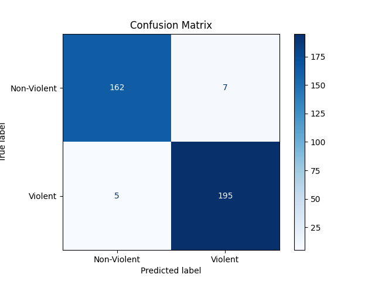
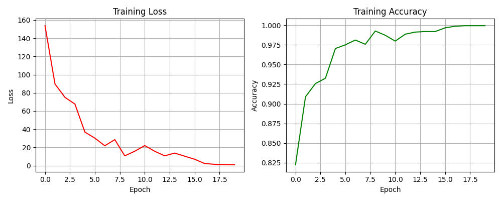

# 🎥 Intelligent Video Surveillance System


Deep-learning system that detects **violence in video**. It classifies short clips with a 3D CNN (R3D-18), shows *when* violence happens with a per-clip probability timeline, and shows *where* it happens with Grad-CAM heatmaps and YOLOv5 person boxes. Videos are uploaded and analysed through a Streamlit web app.

## 📊 Results

R3D-18, evaluated on **369 held-out test videos** from the Real Life Violence Situations dataset ([`evaluate.py`](evaluate.py), [`evaluation_metrics.csv`](evaluation_metrics.csv)):

| Accuracy | Precision | Recall | F1 score | Test loss |
|---|---|---|---|---|
| **96.75%** | 96.53% | **97.50%** | **0.970** | 0.086 |

<p align="center">
  
  
</p>

Confusion matrix: 162 true negatives, 7 false positives, 5 false negatives, 195 true positives.

## ✨ Features

- **Violence classification** — Kinetics-400–pretrained R3D-18, fine-tuned with a single binary output on 16-frame clips (112×112)
- **Whole-video analysis** — sliding window (16 frames, stride 8) over the uploaded video, with an overall verdict from the clip probabilities
- **Probability timeline** — chart of violence probability for every clip
- **Grad-CAM explanations** — heatmaps from the last 3D convolutional block showing which regions drove the prediction
- **Person detection** — YOLOv5 marks people; those overlapping the Grad-CAM hotspot are labelled *"VIOLENT – Human"*, and the label stays on that person for the following frames
- **Annotated video export** — downloadable MP4 with heatmaps and person boxes

## 🧠 How it works

1. **Data preparation** ([`data_preparation.ipynb`](data_preparation.ipynb)) — extracts every 5th frame of each video with OpenCV, resizes to 112×112, and splits videos 80/20 (stratified) into `train` and `test`
2. **Dataset** ([`dataset.py`](dataset.py)) — loads the first 16 frames of each video as one clip, shaped `[C, T, H, W]`
3. **Training** ([`train.py`](train.py)) — 20 epochs, Adam (lr 1e-4), batch size 4, `BCEWithLogitsLoss`; saves `r3d_model.pth` and the training graph
4. **Evaluation** ([`evaluate.py`](evaluate.py)) — accuracy, precision, recall, F1 and confusion matrix on the test split
5. **Inference apps** — Streamlit apps that run the sliding-window model over an uploaded video, then add Grad-CAM and YOLOv5 on clips classified as violent

## 📁 Project structure

```
├── data_preparation.ipynb        # Frame extraction + train/test split (also contains a CNN-LSTM baseline experiment)
├── dataset.py                    # 16-frame clip dataset
├── models/
│   └── three_d_cnn_model.py      # R3D-18 violence classifier
├── train.py                      # Fine-tuning script
├── evaluate.py                   # Test-set metrics + confusion matrix
├── model_summary.py              # Prints the model architecture (torchinfo)
├── predict_video.py              # App: sliding-window detection, average/max probability verdict
├── predict_video1.py             # App: detection with segment-based verdict and progress bar
├── predict_video_bounding_box.py # App: detection + Grad-CAM frame panels
├── bounding_enhance2.py          # App: Grad-CAM + YOLOv5 person boxes, annotated MP4 export
├── evaluation_metrics.csv        # Saved test metrics
├── confusion_matrix.png
├── r3d_training_graph.png
└── requirements.txt
```

## 📦 Setup

```bash
git clone https://github.com/BendalamRajeev/Intelligence-Video-Surveillance-System-DSML.git
cd Intelligence-Video-Surveillance-System-DSML

python -m venv venv
source venv/bin/activate      # Windows: venv\Scripts\activate
pip install -r requirements.txt
```

A CUDA GPU is recommended for training; inference also runs on CPU.

## 🚀 Usage

1. **Get the data** — download the [Real Life Violence Situations dataset](https://www.kaggle.com/datasets/mohamedmustafa/real-life-violence-situations-dataset) (1,000 violent and 1,000 non-violent videos).
2. **Prepare frames** — run `data_preparation.ipynb`, pointing `prepare_dataset()` at the dataset folder. This creates `dataset/train` and `dataset/test`, each with `violent/` and `non_violent/` frame folders.
3. **Train** — `python train.py` (writes `r3d_model.pth`).
4. **Evaluate** — `python evaluate.py`.
5. **Run an app**, for example the full Grad-CAM + YOLO version:
   ```bash
   streamlit run bounding_enhance2.py
   ```
   Then open http://localhost:8501, upload an `.mp4`/`.avi` video and start detection. YOLOv5 weights download automatically on first run.

> Model weights are not included in the repository (`r3d_model.pth` is ~133 MB); train the model with step 3 to produce them.

## ⚠️ Limitations

- Works on **uploaded video files**; live camera streams are not supported
- Binary classification only (violent / non-violent) — no theft or other activity classes
- Person labelling is overlap-based, not identity tracking
- Training clips use every 5th frame, while inference uses consecutive frames

## 🛠 Tech stack

PyTorch · torchvision (R3D-18) · OpenCV · Ultralytics YOLOv5 · scikit-learn · Streamlit · NumPy · pandas · Matplotlib

## 👨‍💻 Author

**Bendalam Rajeev** — [GitHub](https://github.com/BendalamRajeev) · [LinkedIn](https://www.linkedin.com/in/bendalam-rajeev-392170274/)

## 📄 License

MIT — see [LICENSE](LICENSE).

## 🙏 Acknowledgments

- [Real Life Violence Situations dataset](https://www.kaggle.com/datasets/mohamedmustafa/real-life-violence-situations-dataset)
- torchvision video models (R3D-18, Kinetics-400 pretrained weights) and Ultralytics YOLOv5
